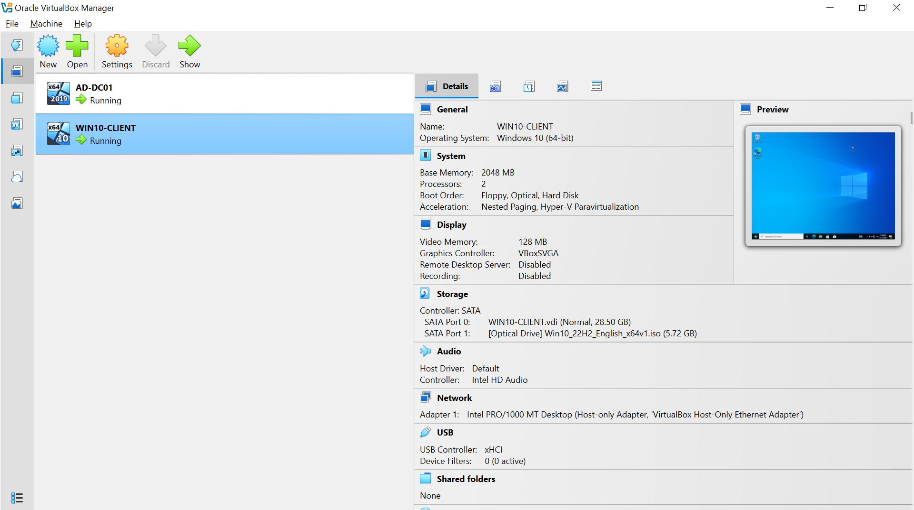
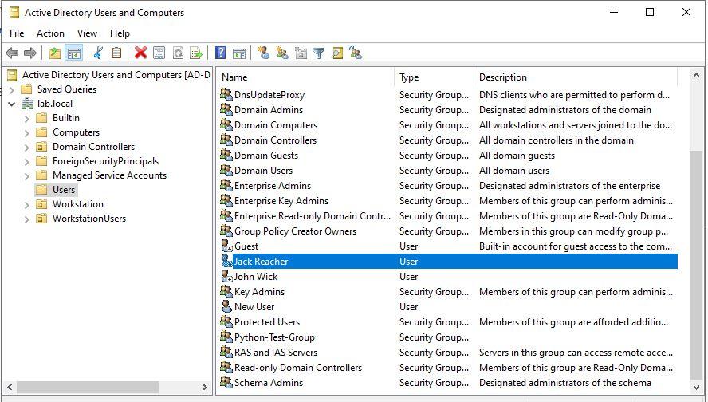
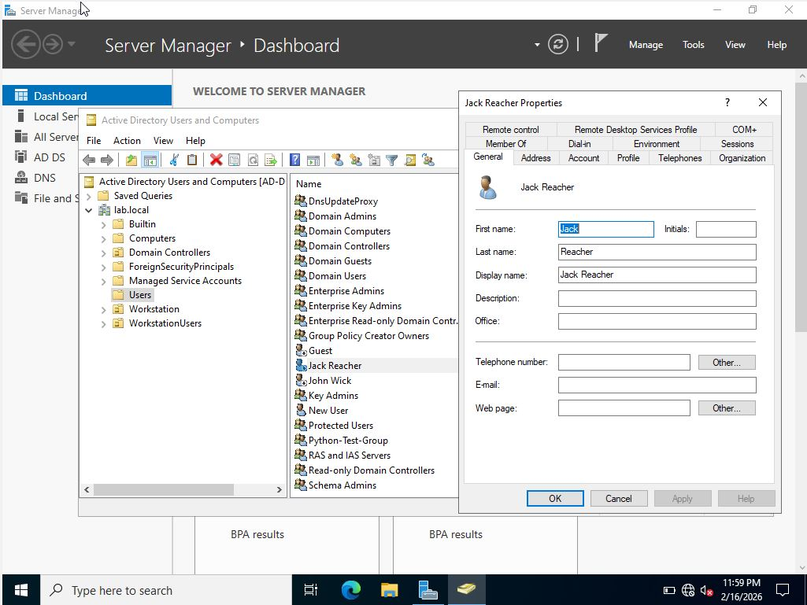

# 📁 Active Directory Automation Tool (adtool)

> A Python-based command-line interface tool for managing Active Directory users and groups via the LDAP api.

---

## 🚀 Overview

`adtool` is a command-line automation utility that connects directly to Active Directory using LDAP and allows administrators to:

- Create users
- Create groups
- Add users to groups
- Remove users from groups
- Enable user accounts
- Disable user accounts
- List users in groups

This project demonstrates:

- Active Directory architecture knowledge
- LDAP operations
- Secure credential handling
- Bitwise manipulation of `userAccountControl`
- Enterprise-style logging
- CLI tool packaging
- Python packaging & distribution

---

## 🧠 Architecture

```
Windows 10 Host
     │
     ├── VirtualBox
     │     ├── AD-DC01 (Windows Server 2019 - Domain Controller)
     │     └── WIN10-CLIENT (Domain Joined)
     │
     └── Python CLI Tool (adtool)
              │
              └── LDAP Bind → Active Directory
```

---

## 📸 Screenshots

### 🖥️ Virtual Lab Environment



---

### 👤 User Created via CLI




---

### 👥 Group Membership Managed via CLI



---

### 📜 CLI Usage Example

> *(Insert screenshot of PowerShell running adtool commands)*

```

```
---

## 🔧 Installation

### 1️⃣ Clone the Repository

```bash
git clone https://github.com/yourusername/adtool.git
cd adtool
```
---

### 2️⃣ Create Virtual Environment

```bash
python -m venv venv
venv\Scripts\activate
```
---

### 3️⃣ Install in Editable Mode

```bash
pip install -e .
```
---

## 🔐 Credentials Setup

Create a file named:

```
credentials.json
```
Format:

```json
{
  "dc_ip": "192.168.56.10",
  "username": "LAB\\Administrator",
  "password": "YourPasswordHere"
}
```
⚠️ **Important:**
Add `credentials.json` to your `.gitignore` file.

---

## 🖥️ Usage

### Create User

```bash
adtool create-user First.Last
```
---

### Create Group

```bash
adtool create-group GroupName
```
---

### Add User to Group

```bash
adtool add-user-to-group First.Last GroupName
```
---

### Remove User from Group

```bash
adtool delete-user-from-group First.Last GroupName
```
---

### List Users in Group

```bash
adtool list-users-in-group GroupName
```
---

### Disable User

```bash
adtool disable-user First.Last
```
---

### Enable User

```bash
adtool enable-user First.Last
```
---

## 🧩 Technical Highlights

### LDAP Binding

Uses `ldap3` to bind directly to Active Directory:

```python
server = Server(DC_IP, get_info=ALL)
conn = Connection(server, user=USERNAME, password=PASSWORD)
conn.bind()
```
---

### Distinguished Name (DN) Handling

Users and groups are located dynamically via LDAP search filters:

```python
conn.search(
    BASE_DN,
    f"(sAMAccountName={username})",
    attributes=["distinguishedName"]
)
```
---

### Bitwise Account Control Management

Account enable/disable is performed using bitwise flag manipulation:

```python
ACCOUNTDISABLE = 2
new_uac = current_uac & ~ACCOUNTDISABLE
```
This preserves all other account flags while toggling only the disable bit.

---

### Logging

Logs are written to:

```
C:\Users\<YourUser>\adtool_logs\adtool.log
```
Logging includes:

- INFO for successful operations
- WARNING for missing objects
- ERROR for LDAP failures
- Full stack traces via `logger.exception()`

---

## 📦 Packaging

Installed locally using:

```bash
pip install -e .
```
Future enhancements:

- Standalone `.exe` build via PyInstaller
- LDAPS (secure LDAP) support
- CSV bulk user creation
- OU selection support
- Password reset functionality

---

## 🎯 Why This Project Matters

This tool demonstrates:

- Understanding of Active Directory object structure
- LDAP search filters and queries
- Distinguished Names (DN)
- Group membership modification
- `userAccountControl` flag handling
- Enterprise logging practices
- CLI application architecture
- Python package distribution

This project operates against a live domain controller in a virtual lab environment.

---

## 🔒 Security Notes

- Credentials stored locally in JSON (lab use only)
- Should use LDAPS (port 636) in production
- Logging excludes sensitive password data
- Designed for controlled testing environments

---

## 📚 Future Improvements

- LDAPS implementation
- Encrypted credential storage
- Role-based access control
- Service account provisioning
- Web-based frontend
- Bulk import/export functionality
- Audit reporting module

---

## 👨‍💻 Author

Built by Brandon Turner
Active Directory | Automation | Systems Engineering
